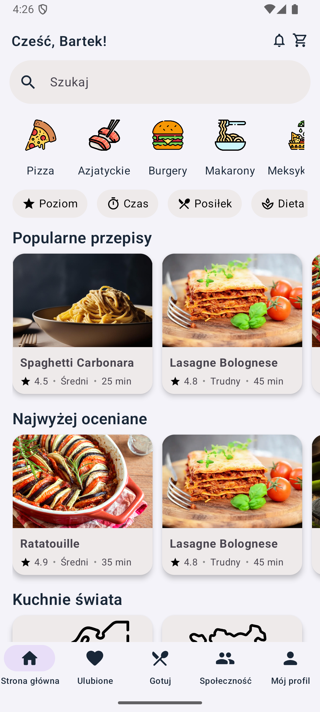
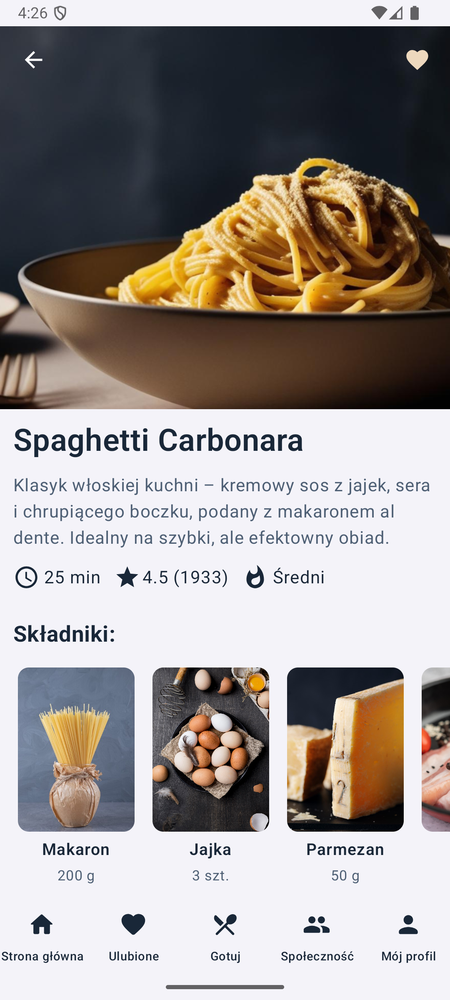
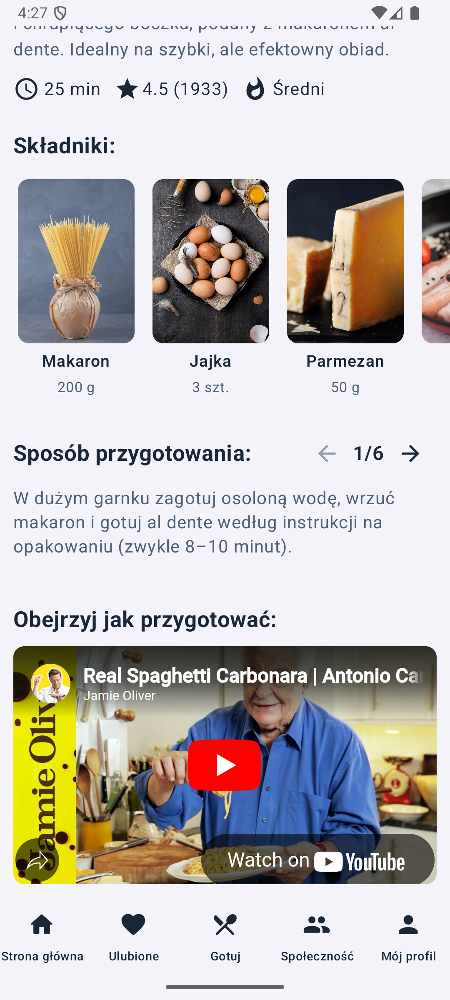

# 🍽️ WhatWeEating

**WhatWeEating** to mobilna aplikacja kulinarna, która pomaga użytkownikom wyszukiwać, filtrować i udostępniać przepisy kulinarne w prosty i przyjazny sposób. Dzięki interaktywnym funkcjom, takim jak wyszukiwanie po składnikach, użytkownicy mogą szybko znaleźć pomysł na posiłek na podstawie tego, co aktualnie mają w lodówce.

Wystarczy zaznaczyć dostępne produkty, a aplikacja automatycznie zaproponuje dania, które można z nich przygotować – to idealne rozwiązanie na szybkie gotowanie bez potrzeby wychodzenia na zakupy. Dodatkowo, aplikacja wspiera komunikację ze znajomymi, umożliwiając dzielenie się przepisami i przesyłanie wiadomości w aplikacji.

---

## 🍳 Funkcjonalności

✅ Przeglądanie popularnych i najlepiej ocenianych przepisów  
✅ Zaawansowane filtrowanie (czas, poziom trudności, rodzaj diety itp.)  
✅ Wyszukiwanie dań na podstawie posiadanych składników  
✅ Szczegółowe przepisy z listą kroków  
✅ Możliwość zapisywania i udostępniania ulubionych przepisów  
🔜 Wbudowany system wiadomości – przesyłaj przepisy znajomym  
🔜 Dodawanie własnych przepisów przez użytkowników  
🔜 System oceniania i komentowania potraw

---

## 🖼️ Zrzuty ekranu
Ekran główny aplikacji:
<p align="center">
  
</p>

Widok z wybranym przepisem
<p align="center">
  
  
</p>


---

## 🛠️ Technologie

**Frontend (Android – Jetpack Compose):**
- Kotlin
- Material 3 + Compose UI
- Navigation Component
- State Management (ViewModel + LiveData/State)

**Backend (planowany):**
- Firebase / Supabase / REST API
- Obsługa logowania, wiadomości i przechowywania danych

**Dane:**
- Lokalnie: obiekty danych w Kotlinie (np. `Recipe`, `Ingredient`)
- Docelowo: integracja z bazą danych online

---

## 🚀 Uruchomienie lokalne (Android Studio)

1. **Klonowanie repozytorium:**
```bash
git clone https://github.com/TwojaNazwaUzytkownika/WhatWeEating.git
cd WhatWeEating
